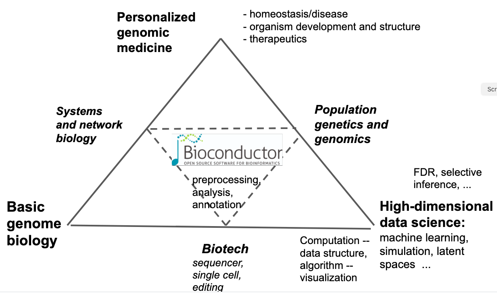

```{r, include = FALSE}
knitr::opts_chunk$set(
  collapse = TRUE,
  comment = "#>"
)
```

# Introduction

We consider software and data concepts related to the
concepts collected in the schema below.


